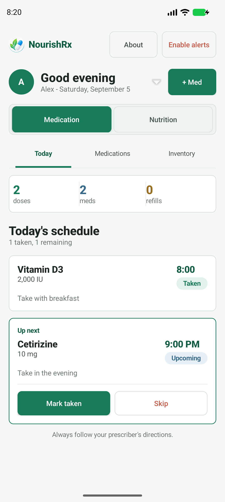
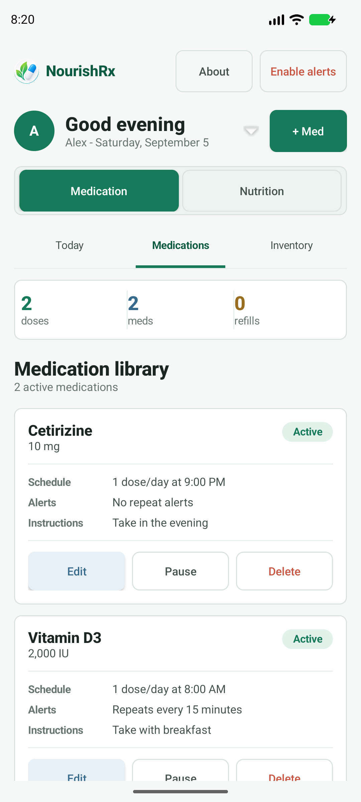
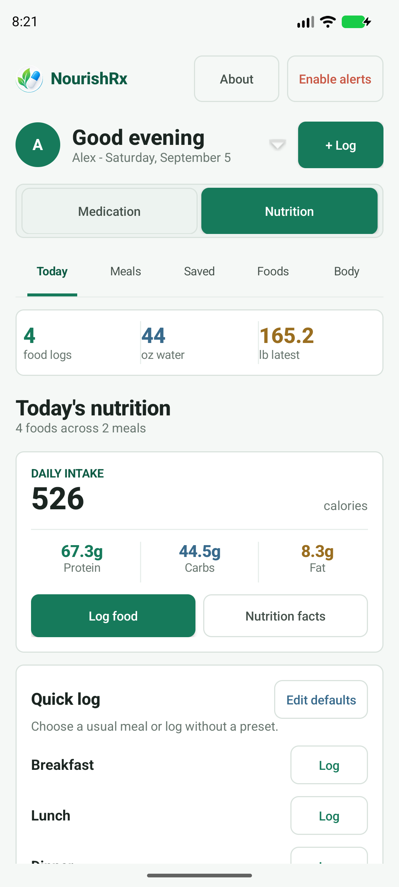
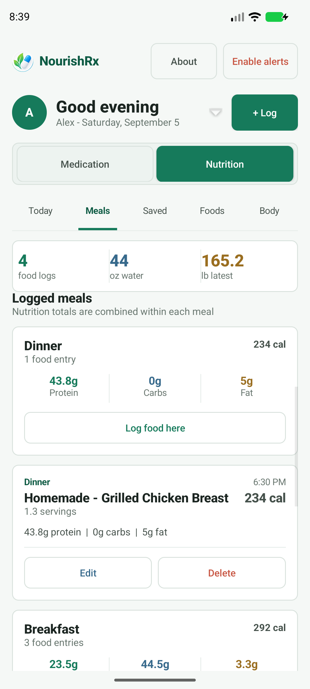
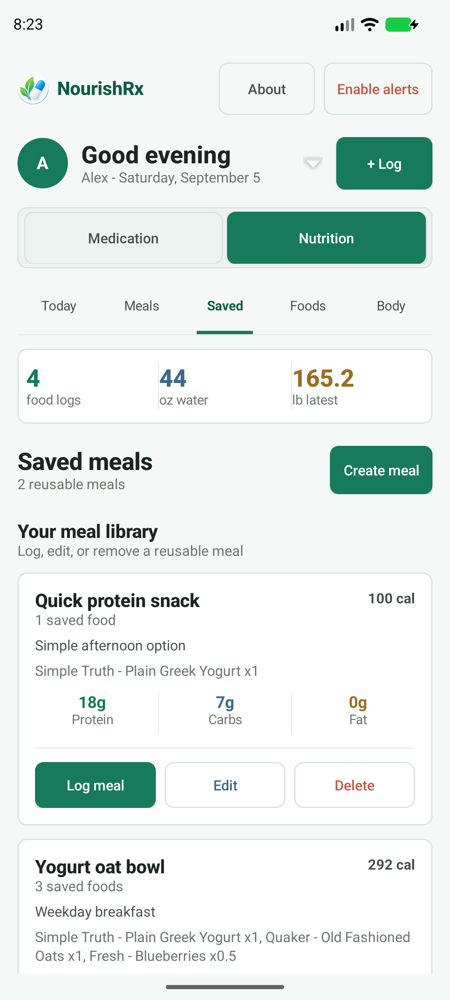
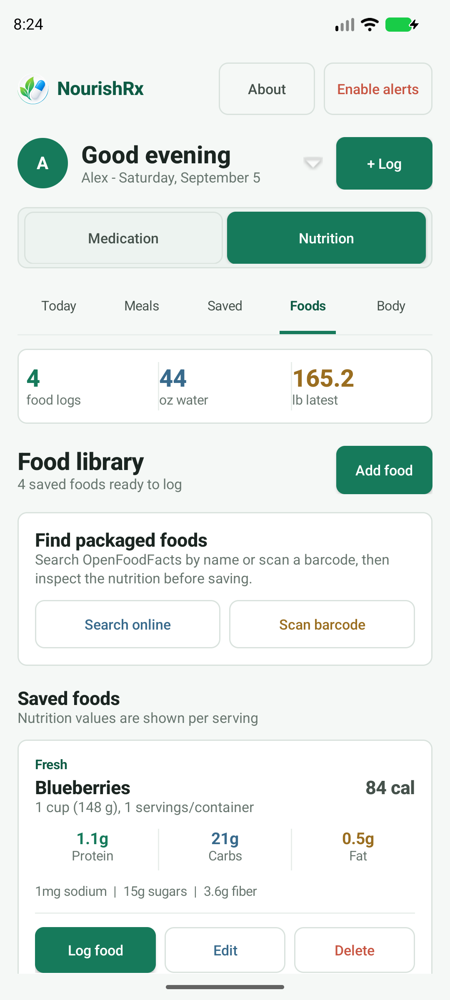

# NourishRx

NourishRx is a native Android health organizer that combines medication scheduling, nutrition tracking, and local data portability. It supports shared profiles, profile-specific reminders, reusable meals and foods, daily nutrition summaries, water and weight tracking, OpenFoodFacts search, barcode lookup, and user-controlled backup files.

This project is built as a personal portfolio app and is not medical software.

Created by [Joseph Bekele](https://github.com/JoJoKorok).

## Features

- Shared profiles with editable names and profile photos across medication and nutrition records.
- Medication scheduling with multiple custom dose times.
- Profile-specific Android reminders with configurable repeat intervals.
- Dose logging with taken and skipped states.
- Inventory tracking with refill warnings.
- Reusable food database with brand, food name, serving size, servings per container, and nutrition facts.
- OpenFoodFacts name search and barcode lookup with inspect-before-save food imports.
- Meal logging with serving amounts and combined nutrition summaries.
- Reusable saved meals and configurable default meal names.
- Daily calorie and macro summaries with water intake and weight tracking.
- Versioned JSON export and validated merge-or-replace import for local data transfers.
- Local SQLite storage with Android cloud backup disabled by default for privacy.

## Screenshots

| Medication schedule | Medication library | Daily nutrition |
| :---: | :---: | :---: |
|  |  |  |

| Meal log | Saved meals | Food library |
| :---: | :---: | :---: |
|  |  |  |

## Tech Stack

- Kotlin and Java 17
- Android framework views
- SQLiteOpenHelper
- AlarmManager, BroadcastReceiver, and NotificationChannel
- ML Kit Barcode Scanning
- OpenFoodFacts public API
- Gson for versioned JSON backups
- JUnit 4 and AndroidX instrumentation tests
- Gradle Android plugin

## Project Shape

```text
app/src/main/java/com/jojokorok/nourishrx/
  MainActivity.java
  BarcodeScannerActivity.java
  about/
  api/OpenFoodFactsClient.java
  backup/
  barcode/
  data/
  medications/
  nutrition/
  premium/
  profiles/
  reminders/
  ui/

app/src/main/res/
  drawable/
  mipmap-anydpi-v26/
  values/

docs/
  ARCHITECTURE.md
  INSTALL_ON_PHONE.md
  RELEASE_PROCESS.md
```

`MainActivity` coordinates app state and routes events between focused feature flows. See [docs/ARCHITECTURE.md](docs/ARCHITECTURE.md) for package responsibilities and the callback pattern used by the application.

## Build

Open the repository in Android Studio, let Gradle sync, then run the `app` configuration on an emulator or Android device.

Command-line debug build:

```powershell
.\gradlew.bat :app:assembleDebug
```

On macOS or Linux, use `./gradlew :app:assembleDebug`.

When Android Studio may be open, use the isolated Windows build command so command-line verification does not share Android Studio's generated files:

```powershell
.\tools\build-android.bat :app:assembleDebug
```

Isolated build outputs are written under `%LOCALAPPDATA%\NourishRx\cli-build` and use a non-persistent Gradle process.

## Backup and Restore

Premium users can open **About & Premium** and use **Backup & transfer** to export or import a versioned JSON backup. Export includes profiles and photos, medication records, nutrition data, foods, saved meals, water entries, weight entries, and relevant app settings.

When importing, **Merge** adds the backup to existing records while **Replace** removes the current local records before restoring the backup. NourishRx validates the file and shows a summary before making changes. Create a current backup before using Replace, and keep exported files private because they may contain sensitive health information and are not encrypted.

## Install on Android

Build a debug APK, then install it with Android Studio or `adb`:

```powershell
adb install -r app\build\outputs\apk\debug\app-debug.apk
```

The `-r` flag updates an existing install while keeping local app data when the package name and signing key match.

See [docs/INSTALL_ON_PHONE.md](docs/INSTALL_ON_PHONE.md) for setup details.

## Privacy

Medication, profile, nutrition, water, and weight data are stored locally on the device. OpenFoodFacts is contacted only when a user explicitly performs an online food search or barcode lookup. Exported JSON backups are created only at a location the user chooses and are not encrypted. The app does not include a private OpenFoodFacts API key.

See [PRIVACY.md](PRIVACY.md) for more detail.

## Medical Disclaimer

NourishRx is a personal organizer and portfolio project. It is not a substitute for professional medical advice, diagnosis, treatment, medication counseling, or nutrition counseling. Medication names, schedules, and nutrition information should be verified against trusted sources such as prescription labels, clinicians, pharmacists, and official nutrition labels.

## Release Notes

Generated APK files should not be committed to the repository. Publish installable APKs through GitHub Releases instead.

See [docs/RELEASE_PROCESS.md](docs/RELEASE_PROCESS.md) for a suggested release workflow.

## License

This project is licensed under the MIT License. See [LICENSE](LICENSE).
